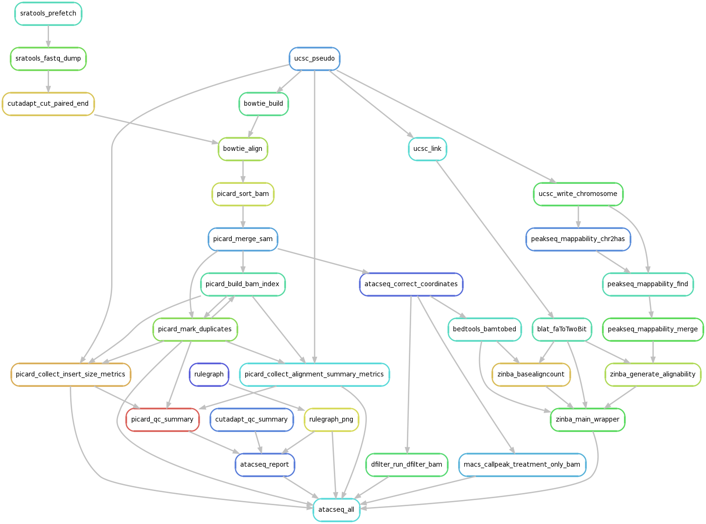

## About ##

The Snakefile and configuration files provide a workflow to regenerate the results of the following study:

	Transposition of native chromatin for fast and sensitive
    epigenomic profiling of open chromatin, DNA-binding proteins and
    nucleosome position.
	
	Buenrostro JD(1), Giresi PG, Zaba LC, Chang HY, Greenleaf WJ.

	Nat Methods. 2013 Dec;10(12):1213-8. doi: 10.1038/nmeth.2688. Epub 2013 Oct 6.

	PMID: 24097267

See also

	ATAC-seq: A Method for Assaying Chromatin Accessibility Genome-Wide.

	Buenrostro JD, Wu B, Chang HY, Greenleaf WJ.

	Curr Protoc Mol Biol. 2015 Jan 5;109:21.29.1-9. doi: 10.1002/0471142727.mb2129s109.

	PMID: 25559105 

## Running ##

Issue

	snakemake data/SRP024293_info.csv

to get the project information.  First run

	snakemake -n -p atacseq_all

to list the commands that will be run.

Then run

	snakemake atacseq_all

to run the entire pipeline. To try it out on sample GSM1155964 run

	snakemake atacseq_all --config samples=["GSM1155964"]

For more general hints, see the main [README](../README.md)

## Rulegraph ##

