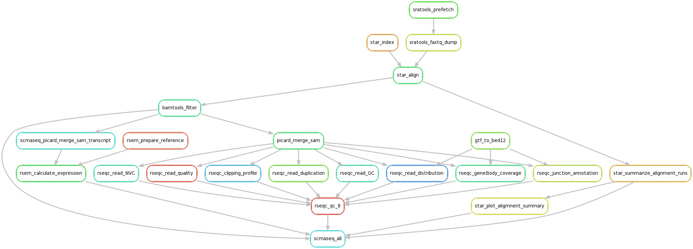

## About ##

The Snakefile and configuration files provide a workflow to regenerate the results of the following study:

	Reconstructing lineage hierarchies of the distal lung epithelium
	using single-cell RNA-seq.

	Treutlein B, Brownfield DG, Wu AR, Neff NF, Mantalas GL, Espinoza
	FH, Desai TJ, Krasnow MA, Quake SR.

	Nature. 2014 May 15;509(7500):371-5. doi: 10.1038/nature13173. Epub
	2014 Apr 13.

	PMID: 24739965

## Running ##

Issue

	snakemake data/SRP033209_info.csv

to get the project information. Then run

	snakemake scrnaseq_all

to run the entire pipeline.

## Rulegraph ##

